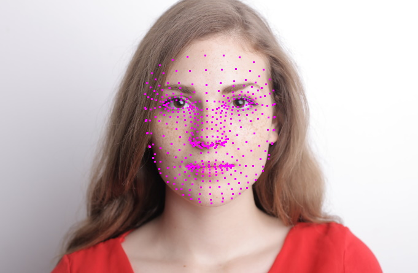
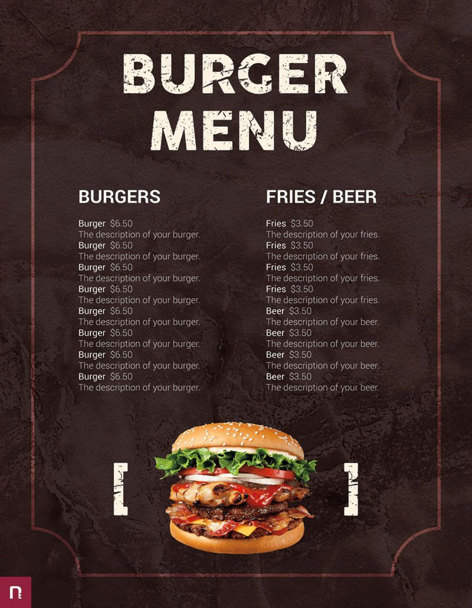
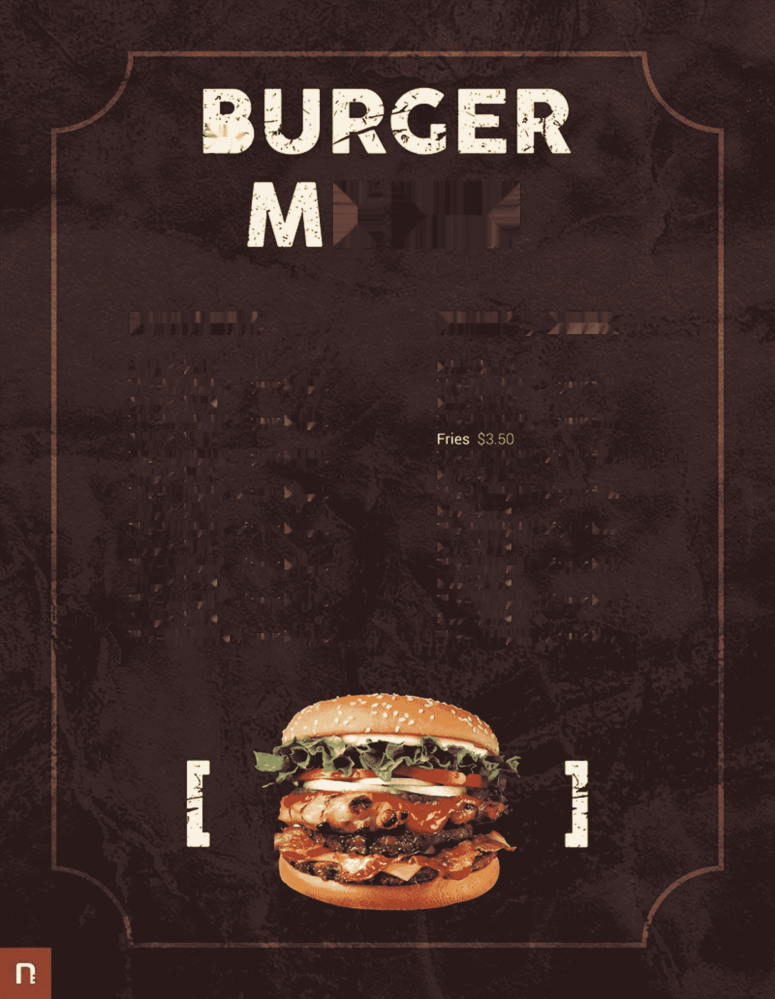
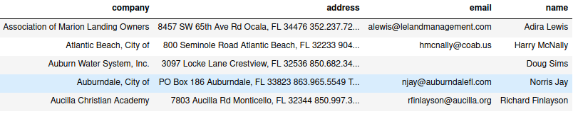

# ML Vision
## Installation

### Python Version

- Python == 3.8 (Any version of Python3 will work fine)

### Library Installation
#### Linux
- Virtual Environment
  - `python3 -m venv venv`
  - `source venv/bin/activate`
- Library Install
  - `pip install --upgrade pip`
  - `pip install --upgrade setuptools`
  - **Requirements Library based on folder**

## Demo 
<table align="center">
  <tr>
    <td><a href="/media_pipe">MediaPipe Hand Detection</a></td>
    <td></td>
  </tr>
  <tr>
    <td><a href="/media_pipe">MediaPipe Face Mesh</a></td>
    <td></td>
  </tr>
  <tr>
    <td><a href="/open_cv">OpenCV Face & Eye Detection</a></td>
    <td></td>
  </tr>
  <tr>
    <td><a href="/image_inpainting">Image Inpainting</a></td>
    <td>
    </td>
  </tr>
  <tr>
    <td><a href="/multiple_column_in_one_page">Image to Text</a></td>
    <td style="vertical-align:top">
    </td>
  </tr>
</table>
