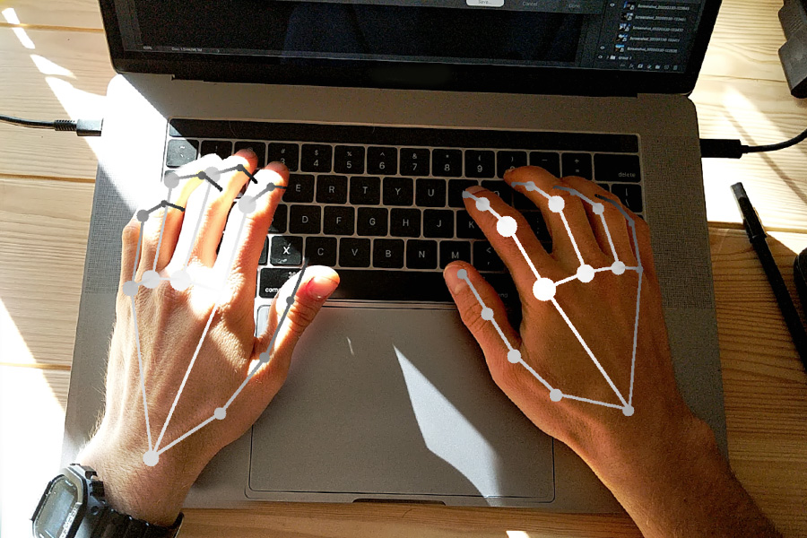

# ML Vision Tools
## Installation

### Python Version

- Python == 3.8 (Any version of Python3 will work fine)

### Library Installation
#### Linux
- Virtual Environment
  - `python3 -m venv venv`
  - `source venv/bin/activate`
- Library Install
  - `pip install --upgrade pip`
  - `pip install --upgrade setuptools`
  - `pip install -r requirements.txt`

## MediaPipe Hand detection
- Using [MediaPipe](https://google.github.io/mediapipe/solutions/hands) Hand Landmark Detection [[mp_hand_detect_sample.py](mp_hand_detect_sample.py)]
- Get & Plot all(20) or specific landmark point based on the index
  - Such as index 4 for the thumb
- Script Run
  - Argument
    - **--all_lm** to show all landmark [By default False]
    - **--connected** to connect all landmark [By default False]
    - **--lm** to show specific landmark [By default -1, range should be 0-19]
    - **--fps** to show FPS [By default False]
  - Show all landmark & do not connect those landmark
    - `python mp_hand_detect_sample.py  --all_lm True`
  - Show all landmark & connect those landmark  
    - `python mp_hand_detect_sample.py --all_lm True --connected True`
  - Show only a speicific landmark(Such as index 4 for Thumb)
    - `python mp_hand_detect_sample.py --lm 4`
  - Show all landmark, connect those landmark & show the fps as well
    - `python mp_hand_detect_sample.py --all_lm True --connected True --fps True`
    <table>
        <tr align='center'>
        <td></td>
        </tr>
    </table>
    <table>
